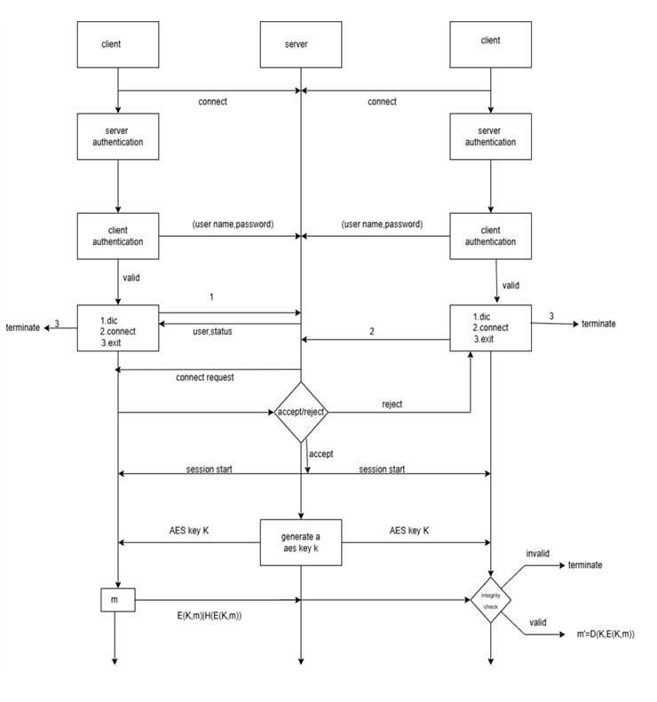

# SecureLinkVPN

**A Lightweight Peer-to-Peer Secure Communication System**

SecureLinkVPN is a custom-built, lightweight system designed to emulate Virtual Private Network (VPN) functionality, enabling secure peer-to-peer communication through a trusted server. This project focuses on encryption, integrity, and minimalism, offering a streamlined alternative to traditional VPNs without the complexity or dependency on third-party providers.

---

## Team Members
- **Raghu Vamsi** - 22CSB0B17  
- **Hema Venkat** - 22CSB0B22  
- **Teja Akshay** - 22CSB0B41  

**Course:** Cryptography (III Year, II Semester)  
**Project Type:** Course Project  

---

## Project Overview

### Introduction
SecureLinkVPN addresses the critical need for secure, private, and reliable data transmission over unsecured networks. It establishes an encrypted communication channel between clients via a trusted server, protecting against cyber threats like man-in-the-middle (MITM) attacks and data breaches.

### Problem Statement
Data transmitted over unsecured networks is vulnerable to interception, tampering, and unauthorized access. Existing VPN solutions, while effective, often involve complexity, resource overhead, and reliance on centralized providers. SecureLinkVPN tackles these issues by providing a lightweight, secure alternative.

### Key Features
- **Lightweight Design:** Minimal complexity with essential security features.
- **Hybrid Cryptography:** RSA for key exchange, AES-256-CBC for data encryption.
- **Server-Mediated P2P:** Encrypted client-to-client communication via a trusted server.
- **Integrity Assurance:** SHA256-based hashing to verify message integrity.
- **Privacy Focus:** End-to-end encryption with optional anonymity (username-based identification).

### Objectives
- Establish a secure TCP tunnel for data transmission.
- Protect against MITM attacks, phishing, and data interception.
- Ensure confidentiality with hybrid cryptography.
- Guarantee message integrity using HMAC/SHA256.
- Mimic VPN-like features with minimal overhead.

---

## Computational Flow Diagram
Below is the computational flow diagram illustrating the workflow of SecureLinkVPN:

  
---

## Prerequisites
- **OpenSSL**: For TLS/SSL and cryptographic operations.
- **G++**: To compile the source code.
- **Cryptography**: Knowledge of RSA, AES-256-CBC, and SHA256 algorithms.
- **Ngrok** (optional): For exposing the server to the internet (used in testing).
- A Unix-like environment (Linux recommended).

---

## Setup Instructions

 **Clone the Repository**
   ```bash
   git clone <repository-url>
   cd SecureLinkVPN
  ```

# Secure Client-Server Communication Setup

## Create the DB Folder for Password Storage

The server stores user credentials (username, hashed password, salt) in a directory named DB.

Run the following command in the project root to create it:
   ```bash
mkdir DB
 ```


## Create the Certs Folder for Certificates

The server requires certificates for encrypted communication. Create a certs folder to store the certificates:
```bash

mkdir certs
 ```

## Generate Certificates

Generate the server certificate and private key:
```bash
openssl req -x509 -newkey rsa:2048 -keyout certs/server_key.pem -out certs/server_cert.pem -days 365 -nodes
 ```
Export the server public key:
```bash

openssl rsa -in certs/server_key.pem -pubout -out certs/server_public_key.pem
 ```

## Running the Program

### Compile the Code

Compile the server:
```bash
g++ -o server server.cpp -lssl -lcrypto
 ```

Compile the client:
```bash
g++ -o client client.cpp -lssl -lcrypto
 ```

### Start the Server

Run the server on port 8080 (default):
```bash
./server
 ```

### Start the Client

Run the client with a username:
```bash
./client <username>
 ```

## Configuration

In the client code, replace SERVER_HOST and PORT with the server's IP address and port number (default is localhost:8080).

If using Ngrok, use the generated Ngrok public URL to replace SERVER_HOST.

## Usage

Signup: Enter 1 at the menu, provide a username and password.

Login: Enter 2, provide your username and password.

Commands:

USERDIC: List active/busy clients.

CONNECT <name>: Request a session with another client.

EXIT: Disconnect from the server.


